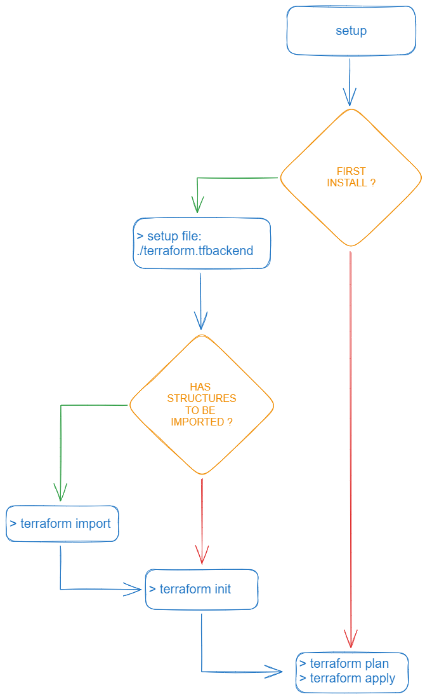

<h1 align="center">
  Terraform + Github
</p>

## Note



### Setup
```sh
# define env var BUCKET_ACCESS
# define env var BUCKET_SECRET
# define env var GITHUB_TOKEN

# go to terra folder
cd ./.terraform

# create terraform.tfbackend
cp "./templates/terraform.tfbackend.template" "./terraform.tfbackend"

# init
terraform init --backend-config="./terraform.tfbackend" \ 
  -backend-config="access_key=$BUCKET_ACCESS" \ 
  -backend-config="secret_key=$BUCKET_SECRET"
```

### Then
```sh
terraform plan -var="github_token=$GITHUB_TOKEN"
terraform apply -var="github_token=$GITHUB_TOKEN"
```

## Import Existing Resources
```sh 
terraform import github_repository.$github_name $repo_name
# example
terraform import github_repository.tmslpm terra-gh
```
> https://registry.terraform.io/providers/integrations/github/latest/docs/resources/repository#import
